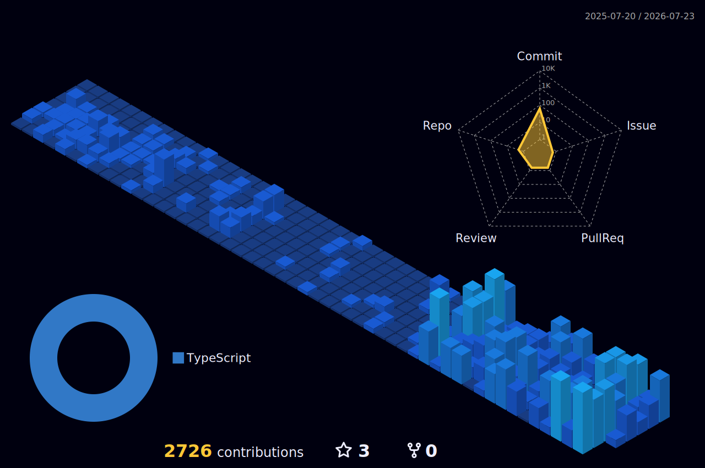

<!--
  GitHub PROFILE README for Mahmoud Othman
  To use: create a repo named EXACTLY your GitHub username (github.com/mo-othman/mo-othman),
  add this file as README.md, commit. Replace mo-othman everywhere (needed for the stat cards)
  and confirm the LinkedIn slug. Everything else is real, pulled from your profile + product sites.
-->

<h1 align="center">Mahmoud Othman</h1>

<b>AI Product Engineer · Technical Co-Founder</b>

  

  
  
  

---

## 🧑‍💻 About

- 🤖 **AI product engineer & technical co-founder.** I ship high-performance, scalable, AI-native products, from idea to production.
- 🎙️ Shipped **[Trelinx](https://trelinx.com.sg)**, *Singapore's AI Receptionist*: real-time **voice AI** + WhatsApp answering every call 24/7 in Singlish, English, Mandarin, Malay, Tamil, and 10+ more.
- 🛡️ Shipped **[DaraVera](https://daravera.com)**: **AI-powered**, tamper-evident credential verification with real cryptographic signing.
- ☸️ Co-built **[K8Studio](https://k8studio.io)**, a Kubernetes IDE: *"Google Maps for your clusters."*
- 🗣️ English · Arabic.
- ⚡ How I ship: *never present a check the system doesn't actually perform.*

---

## 🚧 Building now

> 🩺 **Velmare** · a stealth-stage startup in **healthcare**. Heads-down building, more soon.

## 🚀 Shipped products

| Project | What it is | Stack | Live |
| :--- | :--- | :--- | :---: |
| 🎙️ **Trelinx** · *Co-Founder & CTO* | Singapore's **AI Receptionist** for multi-outlet SMEs: voice + WhatsApp, 24/7, Singlish-native + 15 languages, human handoff, PDPA-compliant. | `TypeScript` `Python` `FastAPI` `Node` `React` `AWS` `Serverless` `Azure AI Foundry` `SIP trunking` `WebSockets` `Voice AI` `LLMs` | **[trelinx.com.sg](https://trelinx.com.sg)** |
| 🛡️ **DaraVera** | **AI-powered**, tamper-evident **credential verification**: issue, cryptographically seal, and verify against a signed registry. | `React` `TS` `Serverless` `PostgreSQL` `AWS Bedrock` `AWS KMS` | **[daravera.com](https://daravera.com)** |
| 🐄 **KSAB** · *client* | Moroccan **livestock marketplace** connecting buyers with farmers nationwide. | `Next.js` `React` `Supabase` | **[ksab.ma](https://ksab.ma)** |

## 🧩 Co-built & contributed

| Project | What it is | Stack | Live |
| :--- | :--- | :--- | :---: |
| ☸️ **K8Studio** · *co-built @ CloudOps* | The **Kubernetes IDE**: agent-free desktop GUI with CloudMaps™ topology, multi-cluster tabs, RBAC/Helm, and high-performance real-time log grids. | `React` `Electron` `TypeScript` `Kubernetes` | **[k8studio.io](https://k8studio.io)** |
| 🏗️ **Metres** · *@ CloudOps* | **Construction-estimation SaaS**: measure areas, lengths, and volumes on digital blueprints to generate instant quotes. Built frontend systems and helped ship it. | `React` `Node` | **[metres.ai](https://metres.ai)** |

Also shipped across CloudOps / UoLU and other startups: **RIO** coach app + LMS (RBAC, analytics, contract automation), the **Lobus Art Data Platform** (large-scale art-market data + analyst UI), and **emergency-response systems**.

## 🌍 Domains I've shipped in

`Voice AI` · `Credential security` · `Kubernetes tooling` · `Construction` · `Art-market data` · `Emergency systems` · `LMS / EdTech` · `Agri-marketplace` · `PropTech`

Nine years, many startups, one constant: I go deep in whatever domain the problem lives in, never as a generic textbook problem.

## 🧪 Lab

> A pile of prototypes that never went public: voice agents, dev tooling, AI experiments. I build constantly; only some of it ships. Ask me about the rest.

---

## 🛠️ Tech Stack

**Languages**  
    

**Frontend & Mobile**  
      

**AI & Voice**  
     

**Backend, Cloud & Infra**  
         

---

## 📜 Certifications

---

## 📊 Contributions

Most of my career code lives in private <b>Bitbucket</b> repos across the companies I've built at, so this graph shows only a slice of what I've actually shipped.

  

  <picture>
    <source media="(prefers-color-scheme: dark)" srcset="https://raw.githubusercontent.com/mo-othman/mo-othman/output/github-snake-dark.svg" />
    <source media="(prefers-color-scheme: light)" srcset="https://raw.githubusercontent.com/mo-othman/mo-othman/output/github-snake.svg" />
    
  </picture>

---

## 🌐 Connect

<!-- OPTIONAL cool add-ons I can wire up on request:
     • Animated contribution snake (Platane/snk GitHub Action → output branch)
     • WakaTime weekly coding-time card
     • A custom brand SVG banner (Trelinx/DaraVera)  -->
